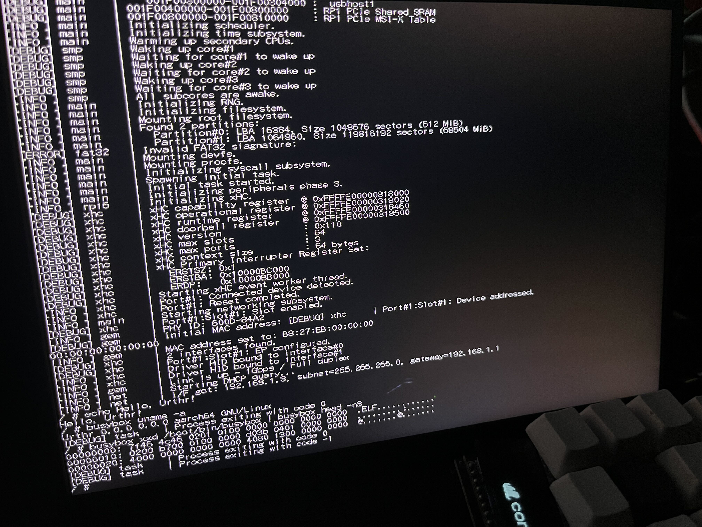

# Urthr


<p align="center">
  <strong><em>
    The operating system on Raspberry Pi 5 written in Zig from scratch.
  </em></strong>
  <br>
  
</p>

## Target Boards

Urthr supports the following boards:

- Raspberry Pi 5
- Raspberry Pi 4B emulated on QEMU
- QEMU virt board

For the supported features on each board, see [Features](#features).

## Features

> Legends:
>
> - `o`: Supported / Partially supported
> - `x`: Not supported
> - `-`: Not applicable

| Group | Feature | RPi5 | RPi4B | virt |
| --- | --- | --- | --- | --- |
| Device Driver | PL011 UART | o | o | o |
| | SDHC | o | x | x |
| | xHCI | o | x | o |
| | PCIe | o | x | o |
| | virtio block | - | o | o |
| | virtio rng | - | o | o |
| Device | Cadence Gigabit Ethernet MAC | o | - | - |
| | DMA | o | o | - |
| | VideoCore framebuffer | o | o | - |
| | Broadcom STB PCIe Controller | o | - | - |
| | Power Management | o | o | o |
| | RP1 Sourthbridge | o | - | - |
| Arch | GICv2 | - | - | x |
| | GICv3 | - | - | o |
| | SMP | o | o | o |
| | PSCI | o | - | o |
| | MSI-X | o | x | o |
| Networking | IP | o | x | x |
| | TCP | o | x | x |
| | UDP | o | x | x |
| | ARP | o | x | x |
| | ICMP | o | x | x |
| File System | FAT32 | o | o | o |
| | devfs | o | o | o |
| | procfs | o | o | o |
| HID | Keyboard | o | x | o |
| | Console Output | o | x | o |

Urthr provides Linux-like user interface (syscalls and other APIs).
See [`syscall.zig`](urthr/kernel/syscall.zig) for the list of supported syscalls.

## Development

### Raspberry Pi 5

Generate all-in-one kernel:

```bash
zig build install --summary all \
  -Dlog_level=debug \
  -Doptimize=Debug \
  -Dboard=rpi5 \
  -Drestart \
  -Drtt \
  -Didle_watchdog=5 \
  -Dsdcard=<path-to-your-sdcard-device>
```

Generate separate serial bootloader + kernel:

```bash
zig build install --summary all \
  -Dlog_level=debug \
  -Doptimize=Debug \
  -Dboard=rpi5 \
  -Dserial_boot \
  -Drestart \
  -Drtt \
  -Didle_watchdog=5 \
  -Dsdcard=<path-to-your-sdcard-device>
```

Send the kernel to RPi5 to boot over serial:

```bash
./zig-out/bin/srboot ./zig-out/bin/remote <path-to-your-serial-device>
```

### Raspberry Pi 4 emulated on QEMU

```bash
export QEMU_DIR=$HOME/qemu-aarch64/bin
zig build run --summary all \
  -Dlog_level=debug \
  -Doptimize=Debug \
  -Dboard=rpi4b \
  -Drtt \
  -Dqemu=$QEMU_DIR \
  -Dsdcreate \
  -Dgraphic
```

### QEMU virt board

```bash
export QEMU_DIR=$HOME/qemu-aarch64/bin
zig build run --summary all \
  -Dlog_level=debug \
  -Doptimize=Debug \
  -Dboard=virt \
  -Drtt \
  -Dqemu=$QEMU_DIR \
  -Dsdcreate
```

### Unit Tests

```bash
zig build test --summary all -Doptimize=Debug
```

## Options

| Option | Type | Description | Default |
|---|---|---|---|
| `board` | String: `rpi4b`, `rpi5`, `virt` | Target board. | `rpi4b` |
| `serial_boot` | Flag | Generate bootloader and kernel as a separate binary. | `false` |
| `sdcard` | Path | Path to mounted SD card device. | - |
| `sdin` | Path | Path to SD card image file to be used by QEMU. | - |
| `sdcreate` | Flag | Create SD card image and use it in this run. | - |
| `log_level` | String: `debug`, `info`, `warn`, `error` | Logging level. Output under the logging level is suppressed. | `info` |
| `optimize` | String: `Debug`, `ReleaseFast`, `ReleaseSmall` | Optimization level. | `Debug` |
| `trace` | String (Comma-separated): `sdhc,net,syscall` | Enable trace outputs. | - |
| `rtt` | Flag | Enable runtime tests. | `false` |
| `init` | Path | Path to init binary to run on boot. | `/boot/bin/init` |
| `wait_qemu` | Flag | Make QEMU wait for being attached by GDB. | `false` |
| `qemu` | Path | Path to QEMU (aarch64) directory. | `""` |
| `qemu_log` | String (Comma-separated): `sd`, `usb`, `gic` | Enable specified QEMU verbose log outputs. Comma-separated list. | - |
| `restart` | Flag | Restart the CPU instead of halting on EOL. | `false` |
| `graphic` | Flag | Enable graphical display window in QEMU. | `false` |
| `idle_watchdog` | Integer | Terminate if the idle thread's execution time exceeds this threshold in seconds. | `0` (disabled) |
| `allow_init_exit` | Flag | Allow the init process to exit. When run on QEMU, the exit code is propagated. | `false` |
